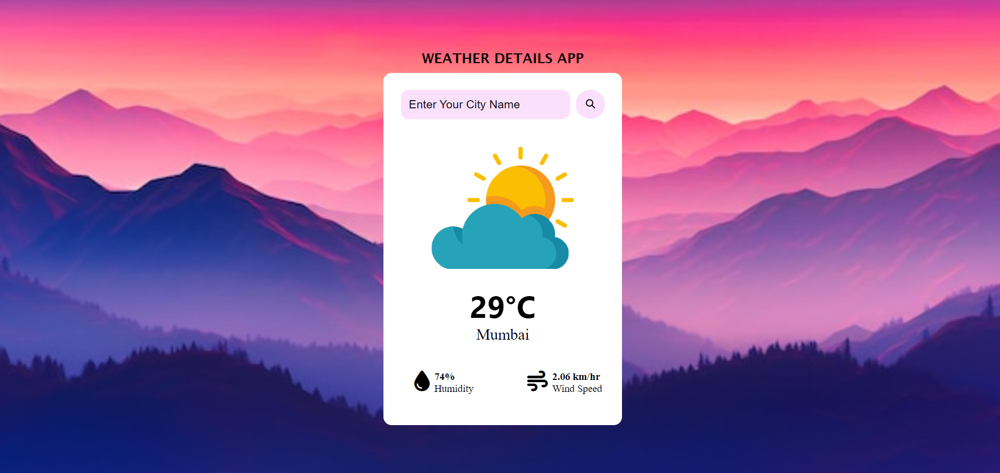

# Weather-app

The Weather App is a simple web application that allows users to check the current weather for any city. Users can enter a city name into a search bar, and the app will display the temperature, humidity, wind speed, and a relevant weather image. If the city is not found, an error message is shown.

## Features
- Search for weather by city name
- Responsive Design
- Shows different weather images based on the weather conditions
- Displays temperature, humidity, and wind speed

## Table of Contents

- [Demo](#demo)
- [Links](#links)
- [Built with](#built-with)
- [What I learned](#what-i-learned)
- [Author](#author)

## Demo

## Links
- URL : [Live Project](https://abhi1226l.github.io/Weather-app/)

## Built with

- Semantic HTML5 markup
- CSS custom properties
- JavaScript
- OpenWeather API
- Font Awesome

## What I learned

I learned how to use CSS properties for responsive design and JavaScript to fetch and display API data dynamically.

 ## Author

- Name - Abhishek

